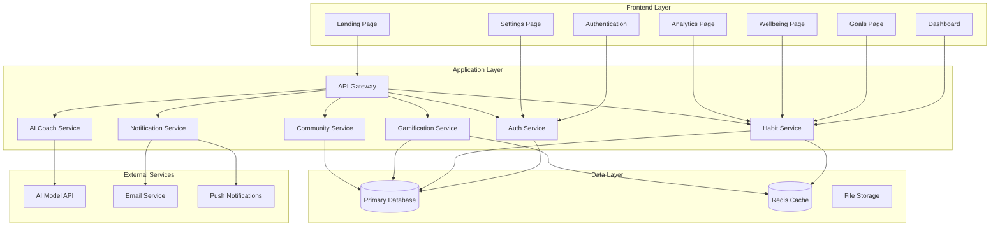
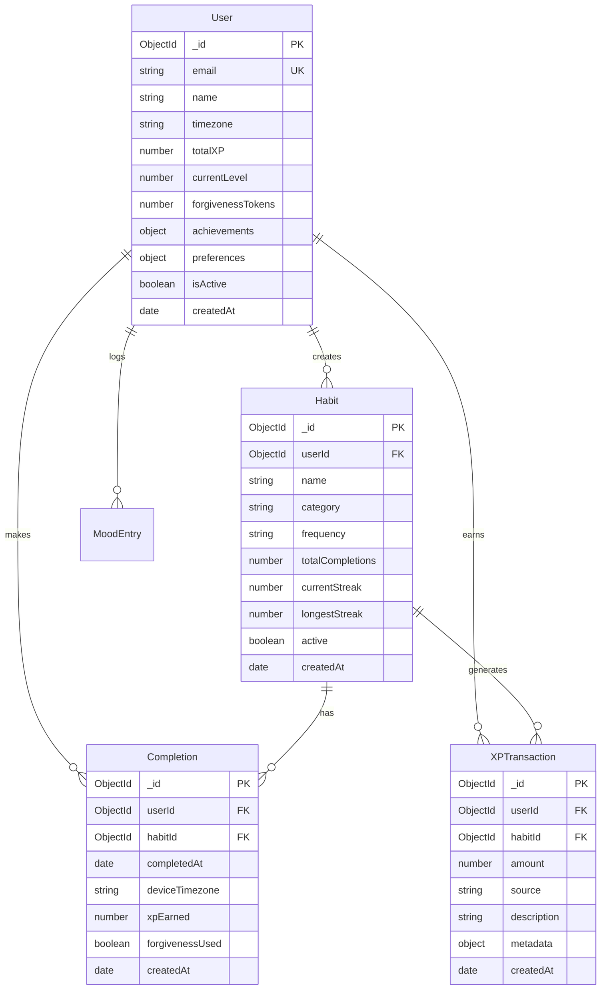

# HabitForge Design Document

## Overview

HabitForge is a modern, gamified habit-tracking web application built with a modular architecture supporting both light and dark themes. The system combines behavioral psychology principles with AI-powered coaching to create an engaging, sustainable habit-building experience.

### Core Design Principles

- **User-Centric Experience**: Intuitive navigation with smooth animations and accessibility compliance
- **Behavioral Psychology**: Gamification elements, forgiveness mechanisms, and positive reinforcement
- **Modular Architecture**: Component-based design for maintainability and scalability
- **Privacy-First**: Granular controls and transparent data handling
- **Cross-Platform Responsive**: Seamless experience across desktop and mobile devices

## Architecture

### High-Level System Architecture



### Technology Stack

**Frontend:**
- **Framework**: React 18 with TypeScript for type safety and modern development
- **Styling**: Tailwind CSS with custom theme system for light/dark modes
- **State Management**: Zustand for lightweight, scalable state management
- **Animations**: Framer Motion for smooth transitions and micro-interactions
- **Charts**: Chart.js for analytics visualizations
- **Icons**: Lucide React for consistent iconography

**Backend:**
- **Runtime**: Node.js with Express.js framework
- **Database**: MongoDB with Mongoose ODM for schema validation and type safety
- **Caching**: Redis for session management and frequently accessed data
- **Authentication**: JWT tokens with refresh token rotation
- **File Storage**: AWS S3 for user avatars and exports

**External Integrations:**
- **AI Coaching**: AWS Bedrock (Claude) with OpenAI GPT-4 fallback
- **Notifications**: AWS SNS for push notifications, SendGrid for email
- **Analytics**: Custom implementation with data export capabilities

## Components and Interfaces

### Frontend Component Architecture

```
src/
├── components/
│   ├── ui/                     # Reusable UI components
│   │   ├── Button.tsx
│   │   ├── Input.tsx
│   │   ├── Modal.tsx
│   │   ├── Card.tsx
│   │   └── ThemeToggle.tsx
│   ├── layout/                 # Layout components
│   │   ├── Header.tsx
│   │   ├── Sidebar.tsx
│   │   ├── Footer.tsx
│   │   └── PageLayout.tsx
│   ├── habit/                  # Habit-specific components
│   │   ├── HabitCard.tsx
│   │   ├── HabitForm.tsx
│   │   ├── CompletionButton.tsx
│   │   └── StreakDisplay.tsx
│   ├── gamification/           # Gamification components
│   │   ├── XPBar.tsx
│   │   ├── LevelBadge.tsx
│   │   ├── CelebrationModal.tsx
│   │   └── ForgivenessToken.tsx
│   ├── analytics/              # Analytics components
│   │   ├── ProgressChart.tsx
│   │   ├── ConsistencyCalendar.tsx
│   │   ├── TrendGraph.tsx
│   │   └── WeeklySummary.tsx
│   └── community/              # Community components
│       ├── CircleCard.tsx
│       ├── Leaderboard.tsx
│       ├── MessageThread.tsx
│       └── ModerationPanel.tsx
├── pages/                      # Page components
│   ├── LandingPage.tsx
│   ├── Dashboard.tsx
│   ├── GoalsPage.tsx
│   ├── WellbeingPage.tsx
│   ├── AnalyticsPage.tsx
│   └── SettingsPage.tsx
├── hooks/                      # Custom React hooks
│   ├── useHabits.ts
│   ├── useGamification.ts
│   ├── useTheme.ts
│   └── useTimezone.ts
├── services/                   # API service layer
│   ├── api.ts
│   ├── habitService.ts
│   ├── authService.ts
│   └── aiService.ts
├── stores/                     # Zustand stores
│   ├── authStore.ts
│   ├── habitStore.ts
│   ├── themeStore.ts
│   └── notificationStore.ts
├── utils/                      # Utility functions
│   ├── dateUtils.ts
│   ├── timezoneUtils.ts
│   ├── validationUtils.ts
│   └── animationUtils.ts
└── types/                      # TypeScript type definitions
    ├── habit.ts
    ├── user.ts
    ├── gamification.ts
    └── api.ts
```

### Key Component Interfaces

**HabitCard Component:**
```typescript
interface HabitCardProps {
  habit: Habit;
  onComplete: (habitId: string) => void;
  onEdit: (habit: Habit) => void;
  showStreakAnimation?: boolean;
  compact?: boolean;
}
```

**XPBar Component:**
```typescript
interface XPBarProps {
  currentXP: number;
  levelXP: number;
  nextLevelXP: number;
  animated?: boolean;
  showLevelUp?: boolean;
}
```

**ThemeToggle Component:**
```typescript
interface ThemeToggleProps {
  size?: 'sm' | 'md' | 'lg';
  showLabel?: boolean;
  position?: 'header' | 'settings' | 'floating';
}
```

### Backend API Interfaces

**Habit Service Interface:**
```typescript
interface HabitService {
  createHabit(userId: string, habitData: CreateHabitRequest): Promise<Habit>;
  updateHabit(habitId: string, updates: UpdateHabitRequest): Promise<Habit>;
  deleteHabit(habitId: string): Promise<void>;
  getUserHabits(userId: string): Promise<Habit[]>;
  markComplete(habitId: string, date: Date, timezone: string): Promise<Completion>;
  getHabitStats(habitId: string, period: StatsPeriod): Promise<HabitStats>;
}
```

**Gamification Service Interface:**
```typescript
interface GamificationService {
  getGamificationData(userId: string): Promise<GamificationData>;
  addXP(userId: string, amount: number, source: string, description: string, habitId?: string, metadata?: any): Promise<XPResult>;
  useForgivenessToken(userId: string, habitId: string, date: string, timezone?: string): Promise<ForgivenessResult>;
  getXPHistory(userId: string, params: XPHistoryParams): Promise<XPHistoryResult>;
  calculateLevel(totalXP: number): number;
  updateUserLevel(userId: string): Promise<User>;
}
```

**Wellbeing Service Interface:**
```typescript
interface WellbeingService {
  createMoodEntry(userId: string, moodData: MoodEntryData): Promise<MoodEntry>;
  getMoodEntries(userId: string, params: MoodQueryParams): Promise<MoodEntry[]>;
  getWellbeingScore(userId: string, days?: number): Promise<WellbeingScore>;
  getHabitImpactAnalysis(userId: string, days?: number): Promise<HabitImpact[]>;
  getWellbeingInsights(userId: string): Promise<WellbeingInsights>;
}
```

**AI Coach Service Interface:**
```typescript
interface AICoachService {
  generateNudge(userId: string, context: CoachingContext): Promise<AIMessage>;
  getPersonalizedInsights(userId: string): Promise<Insight[]>;
  logInteraction(messageId: string, interaction: InteractionType): Promise<void>;
  optOutUser(userId: string): Promise<void>;
}
```

## Data Models

### Core Data Entities

**User Model:**
```typescript
interface User {
  id: string;
  email: string;
  name: string;
  avatar?: string;
  timezone: string; // e.g., "Asia/Kolkata"
  level: number;
  totalXP: number;
  forgivenessTokens: number;
  aiOptOut: boolean;
  theme: 'light' | 'dark' | 'system';
  notificationPreferences: NotificationPreferences;
  privacySettings: PrivacySettings;
  createdAt: Date;
  updatedAt: Date;
  softDeleted: boolean;
  deletionRequestedAt?: Date;
}
```

**Habit Model:**
```typescript
interface Habit {
  id: string;
  userId: string;
  name: string;
  description?: string;
  category: HabitCategory;
  frequency: 'daily' | 'weekly' | 'custom';
  reminderTime?: string; // HH:MM format in user's timezone
  reminderEnabled: boolean;
  color: string;
  icon: string;
  active: boolean;
  createdAt: Date;
  updatedAt: Date;
  
  // Computed fields
  currentStreak: number;
  longestStreak: number;
  totalCompletions: number;
  consistencyRate: number;
}
```

**Completion Model:**
```typescript
interface Completion {
  id: string;
  habitId: string;
  userId: string;
  completedAt: Date; // UTC timestamp
  deviceTimezone: string;
  xpEarned: number;
  notes?: string;
  editedFlag: boolean;
  auditLogId?: string;
  createdAt: Date;
}
```

**Challenge Model:**
```typescript
interface Challenge {
  id: string;
  name: string;
  description: string;
  duration: number; // days
  rewardXP: number;
  badgeIcon: string;
  requirements: ChallengeRequirement[];
  active: boolean;
  
  // User participation
  participants: ChallengeParticipation[];
}

interface ChallengeParticipation {
  id: string;
  userId: string;
  challengeId: string;
  startDate: Date;
  endDate: Date;
  completed: boolean;
  progress: number; // 0-100
  habitSnapshotAtJoin: Habit[]; // Frozen habit definitions
}
```

**Community Circle Model:**
```typescript
interface CommunityCircle {
  id: string;
  name: string;
  description?: string;
  createdBy: string;
  members: CircleMember[];
  maxMembers: number; // default 10
  isPrivate: boolean;
  moderationSettings: ModerationSettings;
  createdAt: Date;
  updatedAt: Date;
}

interface CircleMember {
  userId: string;
  role: 'admin' | 'member';
  joinedAt: Date;
  optOutOfLeaderboard: boolean;
}
```

**AI Message Model:**
```typescript
interface AIMessage {
  id: string;
  userId: string;
  messageType: 'nudge' | 'insight' | 'celebration' | 'recovery';
  content: string;
  modelVersion: string;
  promptHash: string;
  contextData: CoachingContext;
  deliveredAt?: Date;
  readAt?: Date;
  interactionType?: 'clicked' | 'dismissed' | 'shared';
  createdAt: Date;
}
```

### MongoDB Database Schema

**MongoDB Collections and Document Structure:**

```javascript
// Users Collection
{
  _id: ObjectId,
  email: String (unique),
  password: String (hashed),
  name: String,
  avatar: String,
  timezone: String, // e.g., "Asia/Kolkata"
  
  // Gamification fields
  totalXP: Number (default: 0),
  currentLevel: Number (default: 1),
  forgivenessTokens: Number (default: 3),
  achievements: [{
    achievementId: String,
    unlockedAt: Date,
    progress: Number
  }],
  challengeParticipations: [{
    challengeId: String,
    joinedAt: Date,
    progress: Number,
    completed: Boolean
  }],
  
  // Preferences
  preferences: {
    theme: String (enum: ['light', 'dark', 'system']),
    timezone: String,
    notifications: {
      email: Boolean,
      push: Boolean,
      reminders: Boolean
    }
  },
  
  isActive: Boolean (default: true),
  createdAt: Date,
  updatedAt: Date
}

// Habits Collection
{
  _id: ObjectId,
  userId: ObjectId (ref: User),
  name: String,
  description: String,
  category: String,
  frequency: String (enum: ['daily', 'weekly', 'custom']),
  reminderTime: String, // HH:MM format
  reminderEnabled: Boolean,
  color: String,
  icon: String,
  active: Boolean (default: true),
  
  // Statistics (calculated fields)
  totalCompletions: Number (default: 0),
  currentStreak: Number (default: 0),
  longestStreak: Number (default: 0),
  consistencyRate: Number (default: 0),
  
  createdAt: Date,
  updatedAt: Date
}

// Completions Collection
{
  _id: ObjectId,
  userId: ObjectId (ref: User),
  habitId: ObjectId (ref: Habit),
  completedAt: Date, // UTC timestamp
  deviceTimezone: String,
  xpEarned: Number,
  notes: String,
  forgivenessUsed: Boolean (default: false),
  editedFlag: Boolean (default: false),
  createdAt: Date
}

// XPTransactions Collection
{
  _id: ObjectId,
  userId: ObjectId (ref: User),
  habitId: ObjectId (ref: Habit, optional),
  amount: Number,
  source: String (enum: ['habit_completion', 'streak_bonus', 'achievement', 'challenge', 'level_bonus', 'daily_bonus', 'other']),
  description: String,
  metadata: {
    streakLength: Number,
    multiplier: Number,
    achievementId: String,
    challengeId: String,
    newLevel: Number,
    oldLevel: Number
  },
  createdAt: Date
}

// MoodEntries Collection
{
  _id: ObjectId,
  userId: ObjectId (ref: User),
  mood: Number (1-5),
  energy: Number (1-5),
  stress: Number (1-5),
  notes: String,
  date: Date,
  timezone: String,
  createdAt: Date,
  updatedAt: Date
}
```

**Database Indexes for Performance:**

```javascript
// Users Collection Indexes
db.users.createIndex({ "email": 1 }, { unique: true })
db.users.createIndex({ "isActive": 1 })

// Habits Collection Indexes
db.habits.createIndex({ "userId": 1, "active": 1 })
db.habits.createIndex({ "userId": 1, "createdAt": -1 })

// Completions Collection Indexes
db.completions.createIndex({ "userId": 1, "completedAt": -1 })
db.completions.createIndex({ "habitId": 1, "completedAt": -1 })
db.completions.createIndex({ "userId": 1, "habitId": 1, "completedAt": -1 })

// XPTransactions Collection Indexes
db.xptransactions.createIndex({ "userId": 1, "createdAt": -1 })
db.xptransactions.createIndex({ "userId": 1, "source": 1 })

// MoodEntries Collection Indexes
db.moodentries.createIndex({ "userId": 1, "date": -1 })
db.moodentries.createIndex({ "userId": 1, "createdAt": -1 })
```

### Data Relationships and Integrity



## Error Handling

### Error Classification and Response Strategy

**Client-Side Error Handling:**

1. **Network Errors**: Automatic retry with exponential backoff, offline mode support
2. **Validation Errors**: Real-time form validation with helpful error messages
3. **Authentication Errors**: Automatic token refresh, graceful logout on failure
4. **UI Errors**: Error boundaries with fallback components and error reporting

**Server-Side Error Handling:**

1. **Business Logic Errors**: Structured error responses with error codes and user-friendly messages
2. **Database Errors**: Connection pooling, query timeouts, and graceful degradation
3. **External Service Errors**: Circuit breaker pattern for AI and notification services
4. **Rate Limiting**: Progressive delays and clear feedback to users

### Error Response Format

```typescript
interface APIError {
  code: string;
  message: string;
  details?: Record<string, any>;
  timestamp: string;
  requestId: string;
}

// Example error responses
const HABIT_ERRORS = {
  HABIT_NOT_FOUND: {
    code: 'HABIT_NOT_FOUND',
    message: 'The requested habit could not be found',
    httpStatus: 404
  },
  COMPLETION_ALREADY_EXISTS: {
    code: 'COMPLETION_ALREADY_EXISTS',
    message: 'This habit has already been completed for the selected date',
    httpStatus: 409
  },
  INVALID_TIMEZONE: {
    code: 'INVALID_TIMEZONE',
    message: 'The provided timezone is not valid',
    httpStatus: 400
  }
};
```

### Graceful Degradation Strategy

1. **AI Coach Unavailable**: Fall back to pre-written motivational messages
2. **Analytics Service Down**: Show cached data with "last updated" timestamp
3. **Notification Service Issues**: Queue messages for retry, show in-app alternatives
4. **Community Features Offline**: Disable social features, maintain core habit tracking

## Testing Strategy

### Testing Pyramid Approach

**Unit Tests (70% coverage target):**
- Utility functions (date handling, timezone conversion, validation)
- Individual React components with various props and states
- Service layer functions and API endpoints
- Business logic for gamification calculations

**Integration Tests (20% coverage target):**
- API endpoint flows with database interactions
- Authentication and authorization workflows
- AI coaching service integration with fallbacks
- Notification delivery across multiple channels

**End-to-End Tests (10% coverage target):**
- Complete user journeys (signup → habit creation → completion → analytics)
- Cross-browser compatibility testing
- Mobile responsiveness validation
- Theme switching and accessibility compliance

### Testing Tools and Framework

**Frontend Testing:**
- **Jest + React Testing Library**: Component unit tests
- **Cypress**: End-to-end testing and user journey validation
- **Storybook**: Component documentation and visual regression testing
- **Axe-core**: Accessibility testing automation

**Backend Testing:**
- **Jest**: Unit tests for services and utilities
- **Supertest**: API endpoint integration testing
- **Testcontainers**: Database integration tests with real PostgreSQL
- **Artillery**: Load testing for performance validation

### Key Test Scenarios

1. **Timezone Handling**: Habit completion across different timezones and daylight saving transitions
2. **Streak Calculations**: Various completion patterns and forgiveness token usage
3. **AI Fallbacks**: Behavior when external AI services are unavailable
4. **Data Privacy**: Proper data deletion and export functionality
5. **Community Moderation**: Rate limiting and content filtering effectiveness

## MongoDB Integration Architecture

### Database Connection and Configuration

**Connection Setup with Mongoose:**
```typescript
// MongoDB connection with Mongoose
const mongoConfig = {
  uri: process.env.MONGODB_URI,
  options: {
    useNewUrlParser: true,
    useUnifiedTopology: true,
    maxPoolSize: 10,
    serverSelectionTimeoutMS: 5000,
    socketTimeoutMS: 45000,
  }
};

// Connection with retry logic
const connectDB = async () => {
  try {
    await mongoose.connect(mongoConfig.uri, mongoConfig.options);
    console.log('MongoDB connected successfully');
  } catch (error) {
    console.error('MongoDB connection error:', error);
    process.exit(1);
  }
};
```

### User Data Isolation Strategy

**Secure Query Patterns:**
```typescript
// All database queries must include userId filtering
const getUserHabits = async (userId: string) => {
  return await Habit.find({ 
    userId: new mongoose.Types.ObjectId(userId),
    active: true 
  }).sort({ createdAt: -1 });
};

// Atomic operations for XP and completion tracking
const completeHabitWithXP = async (userId: string, habitId: string, completionData: any) => {
  const session = await mongoose.startSession();
  
  try {
    await session.withTransaction(async () => {
      // Create completion record
      const completion = new Completion({
        userId,
        habitId,
        ...completionData
      });
      await completion.save({ session });
      
      // Create XP transaction
      const xpTransaction = new XPTransaction({
        userId,
        habitId,
        amount: completionData.xpEarned,
        source: 'habit_completion',
        description: `Completed habit`,
        metadata: completionData.metadata
      });
      await xpTransaction.save({ session });
      
      // Update user's total XP and level
      const user = await User.findById(userId).session(session);
      const newTotalXP = user.totalXP + completionData.xpEarned;
      const newLevel = calculateLevel(newTotalXP);
      
      await User.findByIdAndUpdate(
        userId,
        { 
          totalXP: newTotalXP,
          currentLevel: newLevel
        },
        { session }
      );
    });
  } finally {
    await session.endSession();
  }
};
```

### Optimized Query Patterns

**Analytics Aggregation Queries:**
```typescript
// Efficient aggregation for habit analytics
const getHabitAnalytics = async (userId: string, days: number = 30) => {
  const startDate = new Date();
  startDate.setDate(startDate.getDate() - days);
  
  return await Completion.aggregate([
    {
      $match: {
        userId: new mongoose.Types.ObjectId(userId),
        completedAt: { $gte: startDate }
      }
    },
    {
      $group: {
        _id: '$habitId',
        totalCompletions: { $sum: 1 },
        totalXP: { $sum: '$xpEarned' },
        lastCompletion: { $max: '$completedAt' },
        avgXPPerCompletion: { $avg: '$xpEarned' }
      }
    },
    {
      $lookup: {
        from: 'habits',
        localField: '_id',
        foreignField: '_id',
        as: 'habit'
      }
    }
  ]);
};

// XP history with pagination
const getXPHistory = async (userId: string, page: number = 1, limit: number = 20) => {
  const skip = (page - 1) * limit;
  
  const transactions = await XPTransaction.find({ userId })
    .sort({ createdAt: -1 })
    .skip(skip)
    .limit(limit)
    .populate('habitId', 'name icon color');
    
  const total = await XPTransaction.countDocuments({ userId });
  
  return {
    transactions,
    pagination: {
      page,
      limit,
      total,
      pages: Math.ceil(total / limit)
    }
  };
};
```

### Data Consistency and Validation

**Mongoose Schema Validation:**
```typescript
// User schema with validation
const userSchema = new mongoose.Schema({
  email: {
    type: String,
    required: true,
    unique: true,
    lowercase: true,
    validate: {
      validator: (email: string) => /^[^\s@]+@[^\s@]+\.[^\s@]+$/.test(email),
      message: 'Invalid email format'
    }
  },
  totalXP: {
    type: Number,
    default: 0,
    min: 0,
    validate: {
      validator: Number.isInteger,
      message: 'XP must be an integer'
    }
  },
  currentLevel: {
    type: Number,
    default: 1,
    min: 1,
    validate: {
      validator: Number.isInteger,
      message: 'Level must be an integer'
    }
  },
  forgivenessTokens: {
    type: Number,
    default: 3,
    min: 0,
    max: 10,
    validate: {
      validator: Number.isInteger,
      message: 'Forgiveness tokens must be an integer'
    }
  }
}, {
  timestamps: true
});

// Pre-save middleware for level calculation
userSchema.pre('save', function(next) {
  if (this.isModified('totalXP')) {
    this.currentLevel = Math.floor(Math.sqrt(this.totalXP / 100)) + 1;
  }
  next();
});
```

## Performance Considerations

### Frontend Optimization

1. **Code Splitting**: Route-based and component-based lazy loading
2. **Image Optimization**: WebP format with fallbacks, responsive images
3. **Bundle Analysis**: Regular monitoring of bundle size and dependencies
4. **Caching Strategy**: Service worker for offline functionality and asset caching
5. **State Synchronization**: Optimistic updates with server reconciliation

### Backend Optimization

1. **Database Indexing**: Compound indexes on userId + frequently queried fields
2. **Connection Pooling**: MongoDB connection pool with optimal sizing
3. **Aggregation Pipelines**: Efficient data processing for analytics queries
4. **Caching Layer**: Redis for frequently accessed user data and leaderboards
5. **API Rate Limiting**: Prevent abuse while maintaining good user experience
6. **Background Jobs**: Async processing for AI message generation and analytics

### MongoDB Performance Optimization

1. **Index Strategy**: 
   - Compound indexes: `{ userId: 1, createdAt: -1 }`
   - Sparse indexes for optional fields
   - TTL indexes for temporary data
2. **Query Optimization**:
   - Use projection to limit returned fields
   - Implement pagination for large result sets
   - Use aggregation pipelines for complex analytics
3. **Connection Management**:
   - Connection pooling with appropriate pool size
   - Connection timeout and retry logic
   - Graceful degradation on database unavailability

### Performance Targets

- **First Contentful Paint**: < 1.5s on 3G networks
- **Largest Contentful Paint**: < 2.5s on mobile devices
- **Time to Interactive**: < 3.5s for authenticated pages
- **API Response Time**: < 200ms for 95th percentile of requests
- **Database Query Time**: < 50ms for habit retrieval operations
- **MongoDB Connection Time**: < 100ms for new connections
- **Aggregation Query Time**: < 500ms for complex analytics queries

This design provides a solid foundation for building HabitForge with MongoDB integration, ensuring scalability, maintainability, and user experience as core priorities. The modular architecture with proper data isolation ensures easy future enhancements while the comprehensive error handling and testing strategy supports reliable operation.